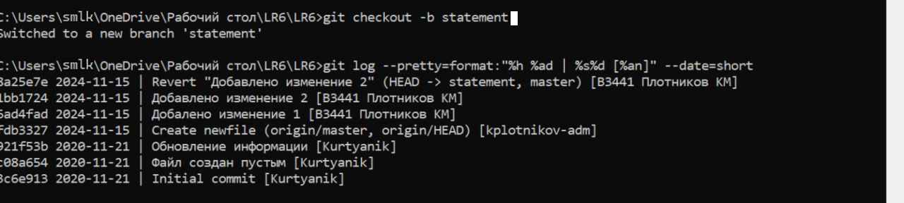

# LR6
Лабораторная работа №6


---

Отчёт по Лабораторной работе №6 

Тема: Система контроля версий   

Цель: Изучение базовых возможностей системы управления версиями, работа с Git API, локальным и удалённым репозиторием.

 1. Создан аккаунт на [GitHub](https://github.com/).

 2. Сделана копия (Fork) репозитория с исходного репозитория по адресу: (https://github.com/Kurtyanik/LR6).

 3. Установлен Git с официального сайта: (https://git-scm.com/).
  
 4. Настроен Git, добавлено имя пользователя и email:
  ```bash
  git config --global user.name "В3441 Плотников КМ"
  git config --global user.email "kplotnikov@geoline-tech.com"
  ```


 5. Личный удалённый репозиторий клонирован на компьютер:
  ```bash
  git clone https://github.com/kplotnikov-adm/LR6
  ```

 6. Новый файл был добавлен через интерфейс GitHub, изменения подтянуты в локальный репозиторий: 
  ```bash
  git pull
  ```


 7. Получена история операций для каждой из веток:
  ```bash
  git log --oneline
  ```


 8. Последние изменения просмотрены с помощью команды:
  ```bash
  git log -p 
  ```


 9. Ветка с изменениями была слита в ветку `master`:
  ```bash
  git checkout -b новая_ветка
  git add .
  git commit -m "Добавлено изменение 1"
  git checkout master
  git merge новая_ветка
  ```


 10. Побочная ветка удалена после успешного слияния:
  ```bash
  git branch -d новая_ветка
  ```

 11. Сделаны несколько изменений и зафиксированы с комментариями:
  ```bash
  git add .
  git commit -m "Добавлено изменение 2"
  ```

 12. Выбран нужный коммит, выполнен откат:
  ```bash
  git log --oneline
  git revert 1bb1724
  ```


 13. Создана отдельная ветка для оформления отчёта:
  ```bash
  git checkout -b statements
  ```

 14. Отчёт оформлен в файле `README.md` с использованием markdown синтаксиса, cкриншоты консоли добавлены в отдельную папку `screenshots`.

 15. Получена история операций с сокращённым хэшем, датой, именем автора и комментарием:
  ```bash
  git log --pretty=format:"%h - %ad - %an - %s" --date=short
  ```


 16. Локальные изменения отправлены в удалённый репозиторий на GitHub:
  ```bash
  git push origin statements
  ```

Вывод:

В процессе работы я освоил базовые команды и операции в Git, включая commit, merge, checkout, pull, push, а также управление ветками и разрешение конфликтов. Получил опыт синхронизации локального и удаленного репозиториев на GitHub и создания отчетов при помощи Markdown.
